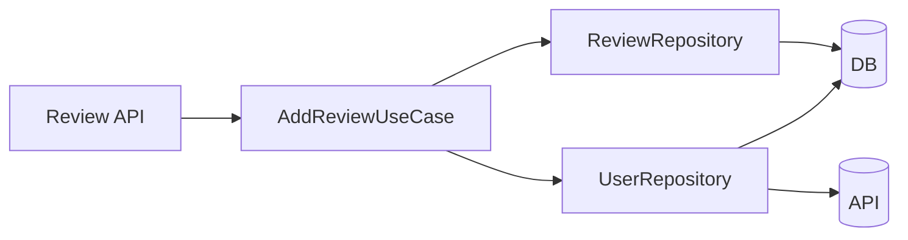

在写后台项目的时候，你可能会发现一个规律：业务量越做越大，代码越写越乱。
尤其当用户模块、商品模块、评价模块扯在一起，各自都要查彼此的数据，没几个月整个项目就会变成“互相 import 大乱炖”。

Clean Architecture 正好帮我们解决这个困局。它把**业务逻辑**和**技术细节**严格隔开，让项目越做越大，但不会越做越乱。

下面这篇文档，会带你把 Clean Architecture 放进 FastAPI 项目，不仅告诉你怎么**分层**，
还会展示**每个模块该长什么样**、**模块之间怎么安全交互**，以及 **Repository 如何组合多个 datasource**。

---

## Clean Architecture 的落地视角

FastAPI 项目到底要分哪些层？如果用一句话概括：

**Domain 管业务词汇，Use Case 管业务流程，Adapters 管适配转换，Datasource 管外部世界。**

落到 FastAPI 项目里，可以拆成：

```
modules/
  user_management/
    core/
      domain/
        user.py
      use_cases/
        create_user.py
    api/
      controllers.py
    infrastructure/
      datasources/
        db_datasource.py
        external_api_datasource.py
      repository.py
```

这些层级不是装饰，而是实打实地把职责分开：

### Domain 作为业务语言的原点

这里放的都是 Pydantic 模型与业务规则定义，不做数据库映射，不调用外部服务。

```python
class User(BaseModel):
    id: Optional[int]
    username: str
    email: str
```

在 domain 层，你甚至不允许写任何 SQLAlchemy 的字段，哪怕只是反射字段，也不要写。只保持**业务信息纯净**。

---

### Use Cases 作为业务行为的 orchestration（编排）

Use Case 层只做一件事：根据业务流程调用 Repository。

它不应该知道你用 PostgreSQL 还是 MySQL，也不认识 requests 库，更不会 import FastAPI。

```python
class CreateUserUseCase:
    def __init__(self, repository: UserRepository):
        self.repository = repository

    def execute(self, user: User):
        if self.repository.find_by_username(user.username):
            raise ValueError("Username already exists")
        return self.repository.save(user)
```

Use Case 很像项目里的**业务经理**，不管事怎么做，只管说 **给我用户数据**、**给我存进去**。

---

### API Controllers 作为用户联络窗口

FastAPI 的 router 属于接口适配层。它负责：

- 接 HTTP 请求
- 调用对应的 Use Case
- 把结果转换成响应

但不应该写任何业务逻辑。

---

### Infrastructure 作为现细节

这里放 Repository、datasource、外部 API client、SQLAlchemy model 等一切“涉及外界”的东西。

让它们紧贴 Use Case，但不反向影响 Domain。

---

## 模块按业务切分

如果你的项目有：

- 用户模块
- 商品模块
- 用户评价模块

每个模块都应该是“自给自足”的生态圈：
有自己的 domain、use case、API、repository、datasource。

### 一个典型目录长这样：

```
modules/
  user_management/
  product_management/
  review_management/
```

每个模块都是一座独立“岛屿”。
而岛屿之间 **不能直接 import 对方的具体实现**。

要访问别的模块的数据怎么办？继续往下看。

---

## 模块之间的数据关联

举个最常会遇到的例子：

> **评价模块要根据 user_id 查询用户信息。**

你不能这样写：

```python
from modules.user_management.infrastructure.repository_impl import UserRepositoryImpl
```

这是硬耦合，一旦 User 模块换数据库实现，评价模块会全部爆炸。

正确方式是下面这样：

### User 模块暴露抽象接口

```python
class UserRepository(ABC):
    def find_by_id(self, user_id: int) -> Optional[User]:
        raise NotImplementedError
```

### Review 模块只依赖接口，不依赖实现

```python
class AddReviewUseCase:
    def __init__(self, user_repo: UserRepository, review_repo: ReviewRepository):
        self.user_repo = user_repo
        self.review_repo = review_repo
```

### 实际实现由 DI（依赖注入）在 app 层注入

在 `main.py`：

```python
app.dependency_overrides[UserRepository] = UserRepositoryImpl(...)
```

这样模块之间没有“互相依赖”，只有“依赖抽象接口”。

---

## Domain（Pydantic BaseModel）与 SQLAlchemy Base 的冲突解决

这是 Clean Architecture 里最常见的问题。

简单说：
**Domain 模型写业务字段；SQLAlchemy 模型写数据库字段；两者用 mapper 转换，别直接混在一起。**

### **为什么不要混？**

- Pydantic 是业务语义
- SQLAlchemy 是存储语义

混一起会让 domain 层**染上数据库味**，导致核心逻辑无法脱离数据库独立存在。

### 推荐方式：显式 mapper

```python
def to_domain(model: UserModel) -> User:
    return User(id=model.id, username=model.username, email=model.email)
```

### 更快方式：Pydantic `orm_mode`

可以让 domain 模型直接从 SQLAlchemy 模型构建：

```python
class User(BaseModel):
    id: int
    username: str

    class Config:
        orm_mode = True
```

---

## Repository 组合多个 datasource 的最佳实践

你可能遇到这些场景：

- 用户资料一部分在 PostgreSQL
- 头像存在 S3
- 用户权限来自 Keycloak
- 用户积分来自 Redis

如果每个 Use Case 都自己请求它们，就会变成灾难。

Repository 的职责就是把这些散乱的数据源整合成“一个干净的数据接口”。

### 示范代码：

```python
class UserRepositoryImpl(UserRepository):
    def __init__(self, db_ds: DatabaseDatasource, api_ds: APIDatasource, cache_ds: CacheDatasource):
        self.db_ds = db_ds
        self.api_ds = api_ds
        self.cache_ds = cache_ds

    def find_by_id(self, user_id: int):
        cached = self.cache_ds.get(user_id)
        if cached:
            return cached

        user = self.db_ds.find_user_by_id(user_id)
        if not user:
            user = self.api_ds.get_user_by_id(user_id)

        if user:
            self.cache_ds.put(user_id, user)

        return user
```

Repository 成为**组合逻辑**的唯一出口，Use Case 看到的就是一种干净的接口。

---

## 一个完整示例流程

以“新增评价”为例：



调用顺序非常清晰：

1. API 收到请求，构造 Pydantic 模型
2. 调用 AddReviewUseCase
3. Use Case 去问 UserRepository “这个用户存在吗？”
4. UserRepository 可能会查 Redis → DB → 外部 API
5. 如果用户存在，Use Case 再写入 ReviewRepository
6. ReviewRepository 写入数据库

整个流程对外表现为“两个模块协作”，但技术上是完全解耦的。

---

## 一点使用感想与踩坑提醒

- **Domain 层千万不要 import SQLAlchemy**，
  不然 Clean Architecture 的边界立刻破坏。

- **Repository 要对外保持稳定接口**，
  因为 Use Case 只依赖这层，一旦改字段或改返回类型，会影响大量 use case。

- **datasource 尽量保持细粒度**，
  S3、Redis、外部 API、数据库最好各自分 datasource，而不是混成一个“万能客户端”。

- **DI (依赖注入) 是 Clean Architecture 的润滑剂**，
  没有 DI，Clean Architecture 实操会非常累。

---

# 结语

FastAPI + Clean Architecture 不只是“分层写代码”这么简单。
它更像是给项目装上了一套“骨架”，把业务语义、数据访问和框架实现各自分隔开。

随着业务增长，你会越来越感受到好处：
模块独立、互不污染、可以替换数据库、可以换外部服务……
而这些改动，都不需要动核心业务逻辑。
