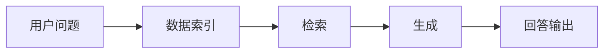
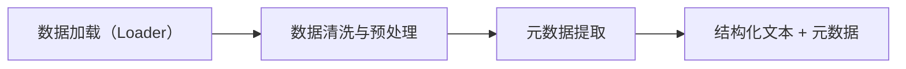

这篇文章算是我这段时间折腾 RAG 的一份「做事笔记」。一开始我也以为，给大模型喂一堆文档，再加个向量库就差不多能用了，
真正落地之后才发现，数据怎么清洗、怎么分块、怎么检索、怎么跟业务规则粘在一起，每一步都在影响最终答案的靠谱程度。

所以我干脆把自己踩过的坑、觉得关键但容易被忽略的细节，按“索引 → 检索 → 生成”这条主线梳理了一遍，
既不追求花哨的新名词，也不讨论太多框架之争，更想回答一个朴素的问题——如果明天就要在真实业务里上一个 RAG 系统，
我到底应该先把精力花在哪些地方？ 希望它能成为你设计和调优 RAG 时的一份参考清单。

## 整体架构

一个典型的 RAG 系统，可以想象成一个三段式流水线：

1. **数据索引（Indexing）**：把原始文档变成可检索的结构化/向量化索引；
2. **检索（Retrieval）**：根据用户问题，从索引中找出最相关的文本块；
3. **生成（Generation）**：把问题 + 检索到的文本一起喂给大模型，由模型生成最终答案。

你可以把它理解成：
**“先搜索，再回答”**，而不是“凭记忆胡乱回”。

## 数据索引

索引阶段的目标，是把杂乱无章的 PDF、Word、Markdown、数据库、API 数据等，变成一套结构化的“知识底座”。

### 数据提取与清洗

通常包含三步：

1. **数据加载（Loader）**

   支持 PDF、Word、Markdown、网页、数据库、API 等多种来源；

2. **数据清洗与预处理**

   去掉不可识别内容（乱码、重复页眉页脚、脚注），
   格式统一：标题、列表、代码块、表格等。

3. **元数据提取**

   如文件名、时间、章节标题、所在系统、业务标签、图片 alt 文本等。
   这些元数据在后面会用于 **过滤和加权**，非常关键。

### 分块（Chunking）：决定“模型看到哪一段”

RAG 的一个核心细节，就是 **“如何把长文档切成一块块”**。这一块做得好不好，直接影响检索效果。

#### 固定大小分块

**做法**：按 token 数（如 256 / 512）或字数硬切；

**问题**：容易把一句话拆成两半，比如：

- chunk A：”我们今天晚上应该……”
- chunk B：”去吃个大餐庆祝一下。”

模型看到任何一个 chunk 都会一头雾水；

**常用修正**：**滑动窗口 + 重叠**，例如：

分块大小 512 tokens，实际步长 480 tokens，
相邻块之间保留一部分重叠内容，减少语义断裂。

#### 基于内容意图的分块（Content-Aware）

这类方法会尽量尊重文本的 **语义边界**：

1. **句分割（Sentence splitting）**

   - 朴素版：按句号、换行切；
   - 高级版：用 NLTK、spaCy 等 NLP 工具识别句子边界，避免把缩写、小数点误当句号。

2. **递归分割（Recursive）**

   先按大粒度（章节、段落）分，再在过大的块上递归细分，直到接近目标大小；

3. **专门的结构化分块**

   对 Markdown、LaTeX 等，按标题层级、列表、代码块做特化分块，以保留原有结构。

#### 如何选择分块策略和块大小？

需要综合考虑：

1. **内容形态**

   长文档（论文、报告） vs 短内容（帖子、推特）；

2. **Embedding 模型的最佳工作区间**

   有的模型在 1 个句子表现最好，有的在 256 / 512 tokens 的块上表现更优；

3. **用户查询的长度与复杂度**

   短问题更适合与句子级向量匹配，
   跨段落的复杂问题，更适合段落 / 文档级向量；

4. **应用场景**

   语义搜索 vs 问答 vs 摘要，对块大小和上下文完整性有不同要求；

5. **大模型的上下文长度（context window）**

   决定一次能放多少检索结果进 prompt。

经验法则：
尽量让一个 chunk 在语义上 **“能独立成段”**，不用严重依赖上下文，也不要大到什么都塞在一起。

### 向量化（Embedding）

索引的下一步，是把每个 chunk 变成向量（embedding），存入向量数据库。

支持对象包括，文本、代码、图片、音频、视频等；

向量维度有，例如 OpenAI `text-embedding-3-small` / 旧版 `text-embedding-ada-002` 是 1536 维，
国内也有 BGE、M3E 等优秀中文模型；

模型选择要考虑以下几点：

- 中英文混合的表现；
- 你的业务领域（金融、医疗、法律、文旅……）；
- 延迟与成本。

一个“好 Embedding”往往比“复杂的 chunking 技巧”更划算——很多研究也发现，
**Embedding 质量经常比微调 chunking 策略对效果影响更大。**

## 检索

RAG 的第二段，是 **Retriever（检索器）**。它的责任是：
在海量 chunks 里，尽量**快且准**地找出真正有用的那几段。

### 元数据过滤

当索引规模大到百万级 chunk，先用元数据过滤可以极大减少候选集，例如：

- 过滤 **时间**：限定某年某月；
- 过滤 **部门 / 项目 / 产品线**；
- 过滤 **文档类型**：合同、技术方案、会议纪要等。

例子：
问题是“帮我整理一下 XX 部门 2023 年 5 月包含某设备采购的合同”，
可以先按元数据筛出“XX 部门 + 2023-05 的合同”，再做向量检索，效率和相关度都会好很多。

### 图关系检索

把实体（人、公司、设备、地点……）建成 **知识图谱**：

- 节点（node）：实体；
- 边（relation）：实体之间的关系（供应、依赖、属于同一项目等）。

对于多跳问题（“A 公司的核心供应商有哪些？这些供应商最近的质量投诉有哪些？”），
基于图索引可以沿着关系链做多跳检索，再组合结果，相关度会显著更高。

### 检索技术

常见手段通常是混着用的：

1. **相似度检索（向量检索）**

   基于欧氏距离、余弦相似度等，从向量库中取出 top-k 相似的 chunks；

2. **关键词检索**

   传统倒排索引仍然很有用：
   可用于元数据过滤、对 chunk 摘要做关键字检索等；

3. **SQL 检索**

   业务数据往往在数据库里，先用 SQL 做结构化过滤，再用 RAG 去解释和生成自然语言结论。

### 重排序（Rerank）

即使检索出了 top-k，排序也不一定是最优的。

**Rerank 的目标：**
根据更复杂的相关度定义，对候选 chunks 做第二轮打分排序。

常见策略包括：

- 使用更强大的 cross-encoder 模型做精排；
- 引入业务特征：权重因素如文档来源可信度、时间衰减、点击量等；
- 内部“判卷老师”：用 LLM 评估“这个 chunk 对当前问题的帮助程度”，不够好就触发重排或追加检索。

### 查询轮换与 HyDE

1. **子查询 / 多查询**

   把复杂问题拆成若干简单子问题，分别检索，再合并，
   例如 LlamaIndex 提供的树查询（Tree Query）、向量查询等多种 Query Engine；

2. **HyDE（Hypothetical Document Embeddings）**

   先让模型根据问题，想象一篇“理想答案草稿”，
   再把这篇草稿向量化，用来检索相似文档，
   实际上是“先抄一篇标准答案，再去找资料”的思路，在很多场景能提升召回。

## 生成（Generation）

RAG 的最后一段，是把：
**用户问题 + 检索到的 chunks + 系统指令 + 模板 Prompt**，
打包送进大模型，生成真正要面对用户的回答。

这里最重要的是 **Prompt 工程**：

1. 告诉模型：

   只能基于给定的资料作答，不要瞎编，
   必须标明引用来源或证据段落；

2. 约束输出格式：

   如表格、JSON、Markdown、小结 + 详细说明等。

3. 鼓励模型自检：

   要求“先列出推理过程的关键步骤（不一定完全展示给用户），再给结论”，
   或让模型在输出前检查“是否有问题没有被资料支持”。

## 分块与 Top-k 带来的坑

在实践中，一个成熟的 RAG 必须面对几类典型问题：

### 分块策略 & top-k 的联动问题

- 块太小：

  信息被拆得太细，同一个事实分散在多个 chunk，
  即使 top-k 很大，也容易漏掉关键上下文。

- 块太大：

  每个 chunk 含有大量无关内容，
  top-k 稍微大一点，prompt 就被“灌爆”，成本和延迟上升。

top-k 通常是个固定数字，但块大小、信息密度、Embedding 质量都在变化，这就决定了：
**top-k 本身也应该是“应用相关”的调优参数，而不是写死一个常数。**

### 世界知识缺失、多跳问题与信息丢失

- **世界知识缺失**：
  RAG 只补充“外部知识库”，并不能让模型无所不知；
  数据库之外的知识依然靠模型预训练的“世界模型”；

- **多跳推理**：
  当问题需要跨多文档、多实体、多时间的推理时：
  仅靠单轮向量检索 + top-k 的策略很不稳定，
  需要图索引、多阶段检索、子查询等配合。

- **信息丢失**：

  分块 + Embedding 本质上是有损过程，
  检索又是有损筛选，
  最后还能塞进 prompt 的上下文长度有限，因此：

  RAG 永远无法做到“信息 100% 不丢”，
  只能通过设计和调优 **尽量少丢、丢得不影响结果**。

## 以 LlamaIndex 为例的索引示例

下面，以 LlamaIndex 为例，介绍常见的索引方案。LlamaIndex 可以理解成一个“索引工厂”，提供多种索引结构用于不同场景：

### 列表索引（List / Summary Index）

文档被分块为一串 Nodes，按顺序排成列表。

查询时可以：
顺序扫描，
或基于 embedding / 关键词取前 k 个。

适合小规模语料、按顺序逐段总结的任务。

### 向量存储索引（Vector Store Index）

每个 Node 都有一个 embedding，被存入向量数据库。

查询时：

1. 对问题做 embedding；
2. 在向量库中找到最相似的 top-k 节点；
3. 交给响应合成模块（Response Synthesizer）。

这是 RAG 中 **最常见的索引形态**。

### 树状索引（Tree Index）

把节点自下而上组织成一棵树，每个非叶子节点是子节点的摘要。

查询时，可以从根节点一路往下走，只遍历和问题相关的分支；

特别适合：
长报告 / 多级目录文档，
对“结构性很强的知识库”做分级检索和摘要。

### 关键词表索引（Keyword Table Index）

从每个 Node 中提取关键词，建立 “关键词 → 节点集合” 的映射。

查询时，根据问题中的关键词匹配节点，再交给合成模块。

优点：

- 对布尔条件、确切关键词有很好效果；
- 可与向量检索结合，形成 **混合检索**。

### 文档摘要索引 & 知识图谱索引

- **文档摘要索引**

  为每个文档生成一段高层次摘要，并对摘要做 embedding，
  检索时先在摘要层面选文档，再在文档内做细粒度检索。

- **知识图谱索引**

  针对实体三元组（subject, predicate, object）建图，
  查询时可只用图做推理，也可结合底层文本一起使用。

## LangChain vs LlamaIndex

如果你在社区里逛得多，应该经常能看到类似的争论：

> 「现在到底该用 LangChain 还是 LlamaIndex？」  
> 「是不是得二选一，all in 某一个框架？」

但真正在项目里跑一阵子就会发现，这个问题本身有点“想多了”。两者的设计重心本来就不一样：

- LlamaIndex 更像是“索引工厂 + 检索中枢”；
- LangChain 更像是“流程编排器 + 工具路由器”。

与其纠结站队，不如承认一个现实：在很多实际系统里，
它们是可以、而且非常适合 **搭配使用** 的，索引和检索交给 LlamaIndex，
整体工作流和 Agent 能力交给 LangChain，各司其职。

如果用一句话概括两者定位：

- **LlamaIndex 的重心在 Index**

  - 如何从各种数据源构建、管理索引；
  - 提供多种索引结构与 Query Engine；

- **LangChain 的重心在 Agent / Chain**

  - 如何把工具、大模型、工作流串成一条“流水线”；
  - 负责复杂的多步调用、规划、外部工具集成等。

在 RAG 项目里一个常见搭配是：

- 用 LlamaIndex 建索引、做检索和路由；
- 用 LangChain 搭建 Agent / Chain，把 RAG 作为其中的一个“能力模块”（工具）。

把这一层“工具怎么配、链路怎么串”想清楚之后，接下来就得往上再抬半层视角了：  
**如果还想把系统效果继续往上推，是该优先打磨 RAG 流水线，还是干脆动模型本身做微调？**

这就自然过渡到了下一节，RAG 和微调分别适合什么场景，
以及它们能不能也像 LangChain / LlamaIndex 一样，形成一种互补共存的组合拳。

## RAG vs 微调

在优化 LLM 时，RAG 和微调是两种常见手段，它们各有长处：

### 适合 RAG 的场景

- 知识 **经常变动**（法规、价格、库存、新闻）；
- 知识 **量很大**，无法全部塞进模型参数；
- 强调 **溯源与可解释性**（要能指出“这条说法来自哪篇文档”）；
- 对风格、口吻要求没那么极端。

### 适合微调（Fine-tuning）的场景

- 追求特定 **文风 / 话术 / 品牌口径**；
- 领域语料比较稳定，有一批高质量的标注数据；
- 更看重“模型说话像谁”，而不是“查到了哪篇文档”。

### 二者组合

很多成熟系统会做 **“RAG + 微调”**：

用微调，让模型更适应该领域的术语、话术、文风，
用 RAG，把最新、最细节的业务知识（合同条款、技术手册）接进来。

可以粗暴理解成：

- 微调 = 改“脑子”和“说话习惯”；
- RAG = 给模型配一个随时更新的“知识库 + 搜索引擎”。

## 小结：RAG 的工程要点

如果你打算在实际项目里上 RAG，可以重点盯这几个工程问题：

1. **数据侧**

   清洗、去噪、结构化、元数据治理；

2. **分块 & Embedding**

   根据应用选择合适的分块策略和块大小，
   选择适合语言/领域的 Embedding 模型。

3. **检索 & 重排**

   元数据过滤 + 向量检索 + 必要的关键词/SQL。
   用 Rerank / 图索引 / 子查询提升复杂问题的表现；

4. **生成阶段的 Prompt 设计**

   明确“只能基于上下文作答”、输出格式和自检机制。

5. **RAG vs 微调**

   对于动态知识和可解释性，优先用 RAG，
   对于风格和长期稳定知识，可考虑微调或两者组合。

## 参考资料

- [What is RAG (Retrieval-Augmented Generation)?](https://aws.amazon.com/what-is/retrieval-augmented-generation)
- [An overview of Retrieval-Augmented Generation (RAG) ...](https://www.aimon.ai/posts/rag_and_its_different_components)
- [Evaluating Chunking Strategies for Retrieval](https://research.trychroma.com/evaluating-chunking)
- [Chunking Strategies for LLM Applications](https://www.pinecone.io/learn/chunking-strategies/)
- [11 Chunking Strategies for RAG — Simplified & Visualized](https://masteringllm.medium.com/11-chunking-strategies-for-rag-simplified-visualized-df0dbec8e373)
- [Chunking Strategies for AI and RAG Applications](https://www.datacamp.com/blog/chunking-strategies)
- [What is Retrieval Augmented Generation (RAG)?](https://www.databricks.com/glossary/retrieval-augmented-generation-rag)
- [Is Semantic Chunking Worth the Computational Cost?](https://arxiv.org/html/2410.13070v1)
- [Indexing - LlamaIndex v0.10.10](https://llamaindexxx.readthedocs.io/en/latest/understanding/indexing/indexing.html)
- [Document summary](https://developers.llamaindex.ai/python/framework-api-reference/indices/document_summary)
- [LlamaIndex: An overview](https://www.leewayhertz.com/llamaindex/)
