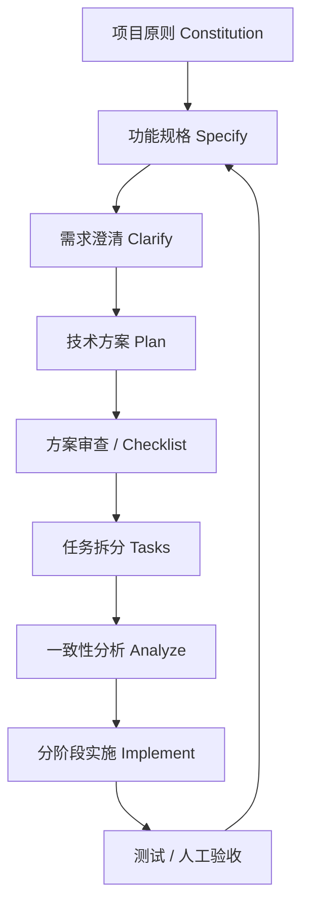

AI 编程很容易让人上头。

一开始，你只需要输入一句：

> 帮我做一个项目管理应用。

Claude Code 很快就能给出路由、列表、表单、弹窗、状态管理，甚至顺手补上几个看起来很完整的组件。页面能跑，交互也有。和从零开始写相比，速度确实快得多。

于是，你开始继续补充规则：

- 阶段不能被直接删除；
- 已归档项目不能再新增阶段和任务；
- 项目进度应按任务完成比例计算，而不是按阶段数量计算；
- 当前先用本地数据，但后续要能平滑接入后端接口；
- 删除阶段时，阶段下的任务要怎么处理。

这时，前面那些 **看起来合理** 的代码就开始出问题了。

最直观的感受，大模型思考的时间开始变长了，接着开始频繁的修补 BUG，直到一切变得失控，你改一个地方，另一个地方开始红。
你让 AI 修，它又顺手改出几个新问题。最后，你只是想加一个小功能，编辑器报出满屏错误，应用直接崩溃。

当你开始补充 “阶段不能直接删除”、“归档项目不能再新增任务”、“进度要按任务完成比例算，不是按阶段数算”、“预留出后端接口” 这些规则时，
前面那些看似合理的代码就开始变得别扭。状态散在组件里，数据关系没有讲清，删除逻辑只能靠补丁修 ——
随着一大堆问题开始涌现出来，修改和调整变得愈发困难，直到某一刻，因为增加一个小功能，编辑器报出满屏错误，应用崩溃了。

然后你也差不多崩溃了。

很多人会在这个时候得出结论：**AI 编程都是营销，吹得天花乱坠，实际没什么用。**

事实是， AI 通常没有故意写错。

更准确地说，它替你提前做了很多你还没有明确做出的业务决策。

一句 **帮我做一个项目管理应用** 里，其实藏着大量没有答案的问题：

- 项目有哪些状态？
- 归档后允许做什么？
- 任务和阶段谁依赖谁？
- 删除是物理删除还是软删除？
- 进度怎么算？
- 数据以后要不要同步到服务端？

人没说，AI 也不能凭空知道。它只能根据常见做法补全一套 **看起来合理** 的实现。

麻烦在于，这些补全往往只在当前页面、当前组件、当前 Prompt 的范围内合理。一旦真正的业务规则补进来，前面的实现就可能需要推倒重来。

复杂功能失控，通常不是因为 AI 不会写代码，而是因为系统里那些关键判断没有被提前说清楚。

## SDD 到底解决什么

SDD（Spec-Driven Development） 的提出，正是为了解决上述问题。

SDD，全称 Spec-Driven Development，也就是规格驱动开发。它的核心想法很简单：

**不要让 AI 从一句模糊的 Prompt 直接跳到代码!!!**

**先把需求、边界、规则和验收条件写成规格，再让 AI 根据这些规格做设计、拆任务、写代码和补测试。**

SDD 要减少的是关键猜测，它通常把一项功能拆成几层：

| 层级  | 关注的问题                                       |
| ----- | ------------------------------------------------ |
| Spec  | 要做什么、规则是什么、哪些情况不允许、怎样算完成 |
| Plan  | 在当前技术栈里准备怎么实现，数据和模块如何协作   |
| Tasks | 具体先改什么、后改什么，每一步落到哪些文件或模块 |
| Tests | 如何证明规则真的生效，而不只是页面看起来没问题   |

它们之间不是彼此独立的材料，而是一条从业务意图走到代码的链路：

```text
用户需求与业务规则
        ↓
Spec：功能边界、约束、验收标准
        ↓
Plan：技术方案、数据模型、模块关系
        ↓
Tasks：可执行的实现步骤
        ↓
Tests：验证规则是否真正落地
        ↓
代码实现
```

规则先被固定下来，再由 Plan、Tasks 和 Tests 一层层传递到实现中。

需求变化后，通常不应该直接让 AI 去改代码，而是先判断变化影响哪一层：

- 如果业务规则变了，先改 Spec；
- 如果数据模型、接口边界或架构选择变了，更新 Plan；
- 如果实现顺序和拆分方式变了，调整 Tasks；
- 如果行为标准变了，补充或修改 Tests；
- 最后再修改代码。

问题越早暴露，就能越早规避，在需求还没变成一堆组件、状态和接口之前。

## Spec 不止是技术说明书

在 SDD 里，Spec 不只是接口字段、数据库表结构或页面原型。

它更接近一份面向行为的功能说明：系统应该做什么，不应该做什么，遇到边界情况时怎么处理，以及怎样证明它做对了。

一个实用的 Spec 至少要回答这些问题：

```text
做什么？
为什么做？
不做什么？
在不同条件下，系统应如何表现？
怎样验证它已经完成？
哪些规则尚未确定，需要先澄清？
```

假设项目管理系统新增一条规则：

> 已归档的项目不能新增阶段和任务。

如果没有明确规格，AI 很可能会直接在项目详情页隐藏 **新增阶段** 和 **新增任务** 按钮。

页面看起来没问题，但规则实际上没有进入系统。

用户仍可能通过其他入口新增任务；后续接入 API 后，接口也可能继续接受写入请求；某个自动化任务甚至可能绕过前端限制，继续向归档项目写数据。

这条规则至少会影响：

- 项目的状态定义；
- 项目详情页和任务页的操作入口；
- 创建阶段、创建任务的业务逻辑；
- 前端提示文案；
- 后端接口的状态校验；
- 自动化任务或批量导入逻辑；
- 相关单元测试和集成测试。

在 SDD 中，这条规则会先进入 Spec，成为明确的业务约束。例如：

```text
FR-012：已归档项目不得新增阶段或任务。

验收标准：
- GIVEN 项目状态为 archived
  WHEN 用户尝试创建阶段
  THEN 系统应拒绝该操作，并提示“归档项目不可新增阶段”。

- GIVEN 项目状态为 archived
  WHEN 用户通过接口提交创建任务请求
  THEN 服务端应返回状态冲突错误，且不得写入任务数据。
```

之后，Plan 需要决定这条状态校验放在哪里：前端、领域服务、后端接口，还是多个层级同时处理。

Tasks 再把它拆成具体工作，例如：

```text
1. 在项目状态模型中定义 archived 状态及其可执行操作；
2. 更新创建阶段和创建任务的业务逻辑；
3. 调整项目详情页的操作入口和提示文案；
4. 在后端接口增加归档状态校验；
5. 补充归档项目创建阶段、创建任务的测试用例。
```

Tests 则验证系统是否真的遵守规则，而不是只验证某个按钮是否隐藏。

这就是 SDD 与 **让 AI 直接改页面** 的区别。

## spec-kit 的标准 SDD 开发工作流

如果想系统理解 SDD（Spec-Driven Development），spec-kit 是一个很合适的参照。

它的价值在于把软件开发中原本分散的工作串成了一条可追踪的链路：先明确项目长期原则，再定义功能需求。
需求中有模糊项，就先澄清。技术方案定下来后，再拆成任务、检查一致性，最后进入实施和回验。

下面这张总览表，说明了每一步的输入、输出和要回答的问题：

| 阶段       | 核心命令                | 主要产物                                                | 负责回答的问题                   |
| ---------- | ----------------------- | ------------------------------------------------------- | -------------------------------- |
| 初始化     | `specify init`          | `.specify/`、Agent 命令模板                             | 如何在仓库中启用 SDD？           |
| 项目原则   | `/speckit.constitution` | `constitution.md`                                       | 所有功能都必须遵守什么？         |
| 功能规格   | `/speckit.specify`      | `spec.md`                                               | 要做什么、为什么做、验收什么？   |
| 需求澄清   | `/speckit.clarify`      | Spec 的 Clarifications 区域                             | 哪些关键规则尚不明确？           |
| 技术计划   | `/speckit.plan`         | `plan.md`、`research.md`、`data-model.md`、`contracts/` | 如何实现，技术决策为何合理？     |
| 计划审查   | 自由 Prompt / Checklist | 更新后的 Plan 与检查表                                  | 是否漏项、过度设计或违反原则？   |
| 任务拆分   | `/speckit.tasks`        | `tasks.md`                                              | 按什么顺序、在哪些文件中完成？   |
| 一致性分析 | `/speckit.analyze`      | 分析结果与修订建议                                      | Spec、Plan、Tasks 是否互相一致？ |
| 实施       | `/speckit.implement`    | 代码、测试、变更记录                                    | 如何按依赖关系落实任务？         |

对应到流程图，从原则、规格、计划到实施回验的闭环如下：


{:.mermaid--narrow}


这套流程把 **让 AI 写代码** 改成了另一种工作方式：先把需要做什么、为什么做、边界在哪里说清楚，再要求代码按这些约束落地。
每一步都有对应的文档产物，后续讨论、审查、返工时也能回到具体文件，而不是重新翻聊天记录。

它尤其适合用来说明一个常被忽略的问题，SDD 不是先写一份需求文档，然后让 Agent 一路执行到底。
真正重要的是在实现前持续消除歧义，在实现后持续核对偏差。

spec-kit 把这些检查点显式放进流程里，因此很容易看清 SDD 各阶段分别在解决什么问题。

### 项目原则（Constitution）

Constitution 不应该写当前功能的细节，而应该写所有功能都必须遵守的原则。

例如：

```markdown
# Project Constitution

## I. Simplicity

- 优先选择最少依赖、最少层级的实现。
- 未经明确要求，不引入服务端、数据库或消息队列。

## II. Testability

- 核心业务逻辑必须具备单元测试。
- 每个用户故事必须有至少一个可验证的验收场景。

## III. UX Consistency

- 表单校验错误必须在字段附近展示。
- 异步操作必须具备 loading、success、error 三种状态。

## IV. Performance

- 首屏不应依赖非必要网络请求。
- 避免对大型列表进行无分页的重复计算。
```

可以把 Constitution 理解为项目级的强约束文件。spec-kit 会将其放在 `.specify/memory/constitution.md` 中，
后续的 Spec、Plan、Tasks 和 Implementation 都应以它为边界。

它不负责规定某个页面怎么实现，而是提前划出“哪些做法不能接受”。例如，项目规定“核心业务逻辑必须有单元测试”，
那么后续任务计划里就不能只列开发任务而不安排测试任务。

### 功能规格（Specify）

`/speckit.specify` 阶段的重点是功能行为，而不是技术实现。

也就是要优先描述行为、目标、边界、验收标准，同时避免过早讨论数据库、框架、状态管理、目录结构。

一份 Spec 至少应回答：

```text
谁使用？
要完成什么？
输入是什么？
输出是什么？
失败时如何表现？
哪些能力明确不做？
如何验收？
```

这里最容易犯的错误，是在需求还没说清楚时，就开始讨论 React、数据库表结构或状态管理方案。
这样写出来的往往不是需求规格，而是带着假设的技术方案。

Specify 阶段应先把 **what and why** 固定下来。至于 **how**，留给后续的 Plan 处理。

### 需求澄清（Clarify）

这是最容易被跳过、但最有价值的一步。

典型待澄清问题包括：

```text
- 删除是软删除还是物理删除？
- 是否允许重复名称？
- 列表为空时显示什么？
- 保存失败时是否保留用户输入？
- 排序是本地排序还是服务端排序？
- 是否支持撤销？
- 数据刷新后是否保留筛选条件？
```

没有 Clarify，Agent 仍然会继续执行，只是它会替你做决定。问题在于，
它做出的默认选择未必符合产品规则，也未必符合现有系统的工程约束。

### 技术方案（Plan）

`/speckit.plan` 不应只是 “帮我用 React 实现”。

一个合格的 Plan 应说明技术方案如何回应需求中的每个关键点，通常包括：

```text
架构边界
├── 前端、服务端、存储、接口的职责
├── 目录结构
├── 数据模型
├── 状态流转
├── 异常与错误处理
├── 测试策略
├── 外部依赖与版本风险
└── 需求到技术方案的映射
```

spec-kit 在这一阶段通常会生成以下文件：

```text
specs/<feature>/
├── plan.md
├── research.md
├── data-model.md
├── contracts/
├── quickstart.md
└── tasks.md
```

其中，`research.md` 用于记录尚未确定的技术问题及结论；`contracts/` 保存接口或事件契约；
`quickstart.md` 则描述关键验证路径，例如如何启动、如何执行核心测试、如何手工验证主要场景。

Plan 的核心不是写得越长越好，而是让后续实施者能看清几个问题：
边界在哪里，数据如何流动，失败时怎么办，以及哪些决策仍有风险。

### 方案审查（Checklist）

Plan 写完后，不要立刻进入 Tasks。

这时最容易出现一种情况：方案看起来已经很完整，实际却悄悄带进了未经确认的假设。
比如需求只是 **支持项目列表筛选**，Plan 却默认要引入全文检索、缓存层和独立筛选服务；
又或者 Constitution 明确要求优先本地实现，方案里仍然加入了新的服务端接口。

因此，在任务拆分前，最好先对 Plan 做一次人工审查。这个环节不要求固定命令，
可以通过自由 Prompt、团队评审或一份项目 Checklist 完成。

审查时重点看以下几类问题：

```text
需求覆盖
- Spec 中的每项核心需求，是否都有对应的技术处理方式？
- 验收标准是否已落实到数据、接口、页面或测试方案中？
- 是否遗漏异常场景、空状态和权限边界？

复杂度控制
- 是否引入了需求并不需要的服务、数据库、消息队列或抽象层？
- 是否为了“以后可能会用到”而提前设计扩展能力？
- 是否存在可以用现有模块解决，却重新建设的能力？

架构与约束
- 方案是否遵守 Constitution 中的项目规则？
- 新增依赖是否合理，版本、许可证和维护成本是否可接受？
- 前端、服务端、存储和接口之间的职责是否清楚？

可实施性
- 数据模型是否支持后续用户故事？
- 接口契约是否足以支撑调用方实现？
- 错误处理、状态流转和测试策略是否具体，而不是只写“需要考虑”？

风险与待定项
- 哪些技术结论仍未验证？
- 哪些外部系统、接口或数据质量会影响实现？
- 是否有必须在开发前确认的决定？
```

也可以直接运行 `/speckit.checklist` 命令，让 Agent 基于现有文档执行一次全面审查。

Checklist 的目标不是把 Plan 改得越来越长，而是删掉不必要的设计，把必须做的事情说清楚。

经过这一步后再进入 Tasks，任务拆分会更稳定。否则，后续任务越细，错误的技术假设就会被拆得越具体，返工也越麻烦。

### 任务拆分（Tasks）

`/speckit.tasks` 的目标不是简单列一张待办清单，而是将计划拆成可执行、可排序、可验证的任务。

一份好的`tasks.md` 通常应包含：

```text
- 明确的任务 ID
- 所属用户故事
- 精确文件路径
- 前置依赖
- 可并行标记 [P]
- 测试优先顺序
- 每个阶段的验收检查点
```

例如：

```markdown
## Phase 2: Shared Foundation

- [ ] T010 Create item type in src/domain/item.ts
- [ ] T011 [P] Add local storage adapter in src/data/local-item-store.ts
- [ ] T012 [P] Add item validation tests in src/domain/item.spec.ts

## Phase 3: User Story 1 - Create Item

- [ ] T020 Implement createItem use case in src/application/create-item.ts
- [ ] T021 Add input form in src/features/items/CreateItemForm.tsx
- [ ] T022 Add component test in src/features/items/CreateItemForm.spec.tsx
- [ ] T023 Verify acceptance scenario AC-001
```

这里的重点不是任务编号本身，而是任务之间的关系要清楚。哪些任务可以并行，哪些必须等基础模型完成后才能开始，
哪些任务完成后应立即验证，都应写出来。

spec-kit 生成 Tasks 时，会将用户故事、依赖关系、文件路径、测试任务和验收检查点一起纳入任务计划。
这使 `tasks.md` 更接近实施路线图，而不是泛泛的开发备忘录。

### 一致性分析（Analyze）

在真正写代码前，应检查几个关键问题：

```text
每项功能需求是否都有对应任务？
每项验收标准是否有验证方式？
每个接口契约是否有调用方和实现方？
是否引入了 Spec 没要求的复杂组件？
是否存在互相冲突的约束？
是否违反 Constitution？
```

这一步防止的是一个非常常见的情况：

```text
Spec 写的是 A
Plan 设计成 B
Tasks 却实现成 C
```

这类偏差在代码写出来之前很难察觉。等到功能已经完成、测试也开始补了，再回头改需求或调整架构，成本通常会高很多。

Analyze 的作用不是给文档挑格式问题，而是验证这几份文档是否在描述同一件事。

### 分阶段实施（Implement）

`/speckit.implement` 会读取 Constitution、Spec、Plan 和 Tasks，并按任务依赖关系推进实现。
`tasks.md` 中定义的测试策略，也应在实施过程中同步执行。

但在实际工程中，不建议把一个较大的功能一次性完全交给 Agent。

更稳妥的节奏是：

```text
Phase 1：基础工程与共享模型
→ 审查

Phase 2：第一个用户故事
→ 运行测试
→ 审查

Phase 3：第二个用户故事
→ 运行测试
→ 审查

Phase N：集成、性能、错误处理、回归测试
```

每完成一个 Phase，都应回看两个问题：这一阶段是否已经满足对应的验收标准；它是否改变了后续阶段的前提。

Tasks 是执行计划，不等于必须在一次命令中执行全部任务。分阶段推进会慢一点，但能更早发现错误，
也更容易控制 Agent 修改代码的范围。

## Claude Code + spec-kit，一个简单的例子

下面以一个简单的项目管理 Web 应用为例。

应用只做三层对象：

```text
项目 Project
  └── 阶段 Phase
        └── 任务 Task
```

技术栈使用：

```text
Vue 3
TypeScript
Vite
Tailwind CSS
shadcn-vue
Vue Router
localStorage
Vitest
```

目标不是做一个完整的 Jira 替代品，只是完成一个本地 MVP：

- 创建项目；
- 在项目下维护阶段；
- 在阶段下维护任务；
- 根据任务完成情况计算项目和阶段进度；
- 数据刷新后保留；
- 所有删除操作有明确确认。

### 先写 Constitution

Constitution 是项目级规则。

它不描述某个功能，而是规定这个项目长期遵守什么工程原则。可以把它理解成写给开发者和 Agent 的 **项目宪法**。

在 Claude Code 中，可以这样提出要求：

```text
/speckit.constitution

为一个 Vue 3 项目管理 Web 应用建立以下规则：

- 使用 TypeScript strict mode。
- 采用 Feature-First 目录结构。
- entities 层不能依赖 features 层。
- Project、Phase、Task 的领域关系必须明确。
- 进度计算、排序、删除级联规则必须封装为可测试的纯函数。
- MVP 使用 localStorage，不引入后端和认证。
- 删除操作必须有确认。
- 核心业务规则必须有 Vitest 测试。
- UI 基于 shadcn-vue 组合实现。
```

生成的 `constitution.md` 如下图所示：



生成后的 Constitution 应该足够具体，让 Agent 在后续任务中知道哪些事情不能随便做。例如，既然约定 **领域规则必须是纯函数**，
那么任务状态切换和进度计算就不应该直接塞进 Vue 组件的 `computed` 里。

### 写功能 Spec

接下来定义项目管理 MVP 的行为，这一阶段不讨论具体技术实现。

```text
/speckit.specify

构建一个本地项目管理 Web 应用。

核心对象关系：
项目包含多个阶段；
阶段包含多个任务；
每个任务必须且只能属于一个阶段。

功能范围：

1. 项目管理
- 创建、编辑、归档和删除项目。
- 项目包含名称、描述、状态、开始日期和目标完成日期。
- 项目列表显示项目名称、状态、进度、阶段数量和未完成任务数。

2. 阶段管理
- 在项目详情页创建、编辑、排序和删除阶段。
- 阶段包含名称、描述、顺序和状态。
- 阶段默认按创建顺序排列。

3. 任务管理
- 在阶段内创建、编辑、完成、重新打开和删除任务。
- 任务包含标题、描述、优先级、状态和截止日期。
- 支持按状态和优先级筛选任务。

4. 进度规则
- 项目进度等于项目全部已完成任务数除以全部任务数。
- 阶段进度等于阶段内已完成任务数除以阶段内任务数。
- 无任务的项目或阶段显示 0%。

5. 数据与边界
- 数据保存在浏览器本地。
- 刷新页面后数据不能丢失。
- 删除项目时，阶段和任务一并删除。
- 删除阶段时，必须提示用户阶段内任务也会被删除。
- 当前版本不包含登录、多用户协作、后端接口、权限管理、文件上传和通知。
```

生成的 `spec.md` 如下图所示：



这一步的重点不是让 Agent 立刻开始编码。

先读一遍生成的 `spec.md`。很多问题在这个阶段就会冒出来。

比如：

- 已归档项目还能不能编辑；
- 已完成项目能不能重新打开；
- 阶段为空时状态应该显示 “未开始” 还是 “进行中”；
- 任务是否需要排序；
- 删除任务后，项目进度是否立即更新；
- 项目是否允许没有阶段。

这些问题不需要一次性全想清楚，但至少要把会影响架构和行为的部分补上。

### 用 Clarify 处理模糊规则

这一步经常被跳过，但在真实项目里很有价值。

可以直接让 Claude Code 集中找模糊点：

```text
/speckit.clarify

重点澄清以下问题：

- 项目归档后是否允许编辑；
- 阶段是否允许为空；
- 已完成项目是否允许新增任务；
- 删除阶段时，任务如何处理；
- 任务截止日期为空时如何展示；
- 项目、阶段、任务分别有哪些状态；
- localStorage 数据结构升级时如何处理旧数据；
- 项目列表默认如何排序。
```



对于这个 MVP，可以做一组简单决策：

| 问题         | 决策                               |
| ------------ | ---------------------------------- |
| 归档项目     | 归档后只读，不允许新增阶段和任务   |
| 空阶段       | 允许，进度显示为 0%                |
| 已完成项目   | 默认只读，重新打开后可继续编辑     |
| 删除阶段     | 用户确认后，阶段和任务一起删除     |
| 截止日期为空 | 显示“未设置截止日期”               |
| 项目排序     | 活跃项目优先，再按最近更新时间倒序 |
| 本地数据升级 | 使用 `schemaVersion` 标识数据版本  |

这类规则看起来琐碎，但它们通常最容易在后期变成“为什么这里和那里表现不一样”的问题。

### 从 Spec 进入技术 Plan

Spec 解决 **做什么**，Plan 才解决 **怎么做**。

这时可以明确技术栈、目录结构、状态管理和测试策略。

```text
/speckit.plan

根据当前 Spec 生成技术实现方案：

- 使用 Vue 3、Vite、TypeScript strict。
- 使用 Tailwind CSS 与 shadcn-vue。
- 使用 Vue Router，包含：
  - /projects
  - /projects/:projectId
- 使用 Feature-First 目录结构。
- 使用 localStorage 持久化数据，并通过 schemaVersion 支持后续升级。
- 状态管理优先使用 composables。
- 只有跨页面共享状态明显复杂时才引入 Pinia。
- 使用 Vitest 测试进度计算、排序、删除级联和本地仓储。
- 使用 shadcn-vue 的 Button、Card、Dialog、Input、Textarea、Progress、Tabs、DropdownMenu、Skeleton 等组件。
```



生成的 `plan.md` 文件中，项目的目录结构如下：

```text
src/
├── entities/                    # 领域层 (框架无关纯函数)
│   ├── __tests__/
│   │   ├── cascade.test.ts
│   │   ├── filtering.test.ts
│   │   ├── progress.test.ts
│   │   ├── sorting.test.ts
│   │   └── validation.test.ts
│   ├── cascade.ts               # 删除级联计算
│   ├── filtering.ts             # 任务筛选
│   ├── progress.ts              # 进度计算
│   ├── sorting.ts               # 排序/重排
│   ├── types.ts                 # 领域类型定义
│   └── validation.ts            # 输入验证
├── features/
│   ├── project-list/            # 项目列表功能
│   │   ├── components/
│   │   │   ├── ProjectCard.vue
│   │   │   ├── ProjectCreateDialog.vue
│   │   │   ├── ProjectEditDialog.vue
│   │   │   └── ProjectListFilters.vue
│   │   ├── composables/
│   │   │   └── useProjectList.ts
│   │   └── types.ts
│   └── project-detail/          # 项目详情功能
│       ├── components/
│       │   ├── PhaseList.vue
│       │   ├── PhaseCard.vue
│       │   ├── PhaseCreateDialog.vue
│       │   ├── TaskCard.vue
│       │   ├── TaskCreateDialog.vue
│       │   ├── TaskEditDialog.vue
│       │   └── TaskFilters.vue
│       ├── composables/
│       │   ├── usePhaseList.ts
│       │   └── useTaskList.ts
│       └── types.ts
├── shared/
│   ├── components/
│   │   ├── ui/                  # shadcn-vue 组件 (按需安装)
│   │   │   ├── Button.vue
│   │   │   ├── Card.vue
│   │   │   ├── Dialog.vue
│   │   │   ├── AlertDialog.vue
│   │   │   ├── Input.vue
│   │   │   ├── Textarea.vue
│   │   │   ├── Select.vue
│   │   │   ├── Badge.vue
│   │   │   ├── Progress.vue
│   │   │   ├── Tabs.vue
│   │   │   ├── DropdownMenu.vue
│   │   │   └── Skeleton.vue
│   │   └── ConfirmDialog.vue    # 删除确认弹窗 (复用)
│   ├── migrations/
│   │   └── index.ts             # 迁移链注册
│   ├── storage.ts               # localStorage 适配器
│   └── types.ts                 # 共享类型
├── stores/
│   └── projects.ts              # Pinia store (跨路由项目数据)
├── router/
│   └── index.ts                 # Vue Router 配置
├── App.vue                      # 根组件 (布局壳)
└── main.ts                      # 入口 (注册 Router/Pinia)
```

生成的 `data-model.md` 文件中，领域类型也在这一阶段定下来：

```text
### Project

| Field | Type | Required | Default | Notes |
|-------|------|----------|---------|-------|
| `id` | `string` (UUID v4) | ✅ | 自动生成 | 主键 |
| `name` | `string` (1-200 chars) | ✅ | — | 项目名称，trim 后不能为空 |
| `description` | `string` | ❌ | `""` | 项目描述 |
| `status` | `"active" \| "completed" \| "archived"` | ✅ | `"active"` | 状态转换见下方 |
| `startDate` | `string \| null` (ISO 8601 date) | ❌ | `null` | 开始日期 |
| `targetEndDate` | `string \| null` (ISO 8601 date) | ❌ | `null` | 目标完成日期 |
| `createdAt` | `string` (ISO 8601 datetime) | ✅ | 自动生成 | 创建时间戳 |

**State Transitions**:
"""
active ──→ completed  (用户手动标记；当所有任务完成时系统提示)
active ──→ archived   (用户手动归档)
completed ──→ active  (重新打开)
completed ──→ archived (归档已完成项目)
archived ──→ active   (取消归档)
"""

**Constraints**:
- `active` 和 `archived` 状态下允许编辑字段
- `completed` 和 `archived` 状态下不允许新增 Phase 和 Task
- `archived` 状态下不允许编辑（需先恢复为 `active`）
- 删除时级联删除所有 Phase 和 Task

**Derived Fields** (不存储，由纯函数计算):
- `progress`: `completedTasks / totalTasks * 100`，无任务时为 0
- `phaseCount`: Phase 数量
- `incompleteTaskCount`: 非"已完成"状态的 Task 总数
```

这里有一个细节值得注意：

| `Task` 同时保存 `projectId` 和 `phaseId`，还是只保存 `phaseId`，并通过 Phase 反查 Project ？

两种方案都可以，但应该在 Plan 里决定，而不是写到一半才发现查询不方便。

对于这个本地 MVP，保留 `projectId` 能简化查询和数据校验，但也需要保证它和 `phaseId` 的归属一致。
只保存 `phaseId` 更干净，但读取项目任务时要多做一步关联。没有绝对正确答案，关键是别让每个组件自己决定。

### 把 Plan 拆成 Tasks

任务不应该写成：

```text
完成项目管理模块
完成阶段管理模块
完成任务管理模块
```

这对人和 Agent 都没有帮助。

好的任务需要有明确范围、文件路径、依赖关系和验收条件。对于这个项目，可以按 Phase 拆：

```text
Phase 1：工程初始化与领域基础
Phase 2：项目 CRUD
Phase 3：阶段管理
Phase 4：任务管理与进度计算
Phase 5：筛选、状态反馈和视觉完善
Phase 6：测试与收敛
```

在 Claude Code 中：

```text
/speckit.tasks

将工作按 Phase 拆分。

要求：
- 每项任务包含唯一编号、所属用户故事、相关文件路径和完成条件。
- 标记可并行任务，但避免同时修改同一个文件。
- 每个 Phase 结束后都可以独立运行测试和人工审查。
- 必须包含领域单元测试、组件测试和核心路径 E2E 测试。
```



这时，任务不只是待办清单。它开始成为需求和代码之间的桥。

### 任务执行

直接使用 `/speckit.implement` 一口气跑完整个项目，这是使用 Agent 时很容易犯的错误。

你已经有了几十条任务，于是直接输入：

```text
/speckit.implement
```

然后期待 Agent 把所有内容做完。

它或许真的能一次性写完整个项目。但任务一多，风险也开始放大：

- Agent 会提前实现后续功能；
- 某个早期数据模型决策错了，后面所有组件都建立在错误前提上；
- 测试可能只补在最后；
- 你很难判断问题出在哪个阶段引入。

所以，更稳妥的做法，是按 Phase 执行。

例如，第一轮只做基础层：

```text
/speckit.implement

仅执行 tasks.md 中的 Phase N：[Phase 名称]。

本次允许执行的任务：
- Txxx 至 Txxx

禁止执行：
- 后续 Phase 的任何任务；
- 未列出的任务；
- 与本 Phase 无关的重构；
- 未被 spec.md、plan.md、tasks.md 明确要求的功能。

允许修改的目录：
- src/...
- tests/...
- package.json（仅当本 Phase 任务明确要求新增依赖时）

实施要求：
1. 先读取 constitution.md、spec.md、plan.md、tasks.md。
2. 严格按照任务顺序和依赖关系实施。
3. 对标记 [P] 的任务，可并行分析，但不得产生同文件冲突。
4. 每完成一个任务，更新 tasks.md 中对应复选框。
5. 仅在本 Phase 的所有任务、测试和验收完成后停止。
6. 不进入下一 Phase。
7. 最后输出：
   - 已完成任务；
   - 修改文件列表；
   - 执行的测试及结果；
   - 未解决问题；
   - 是否满足本 Phase Checkpoint。
```

Phase 1 通过后，再做后续的内容。

这种做法会慢一点，但它保留了人工判断的窗口。

AI 写代码很快，人类最有价值的工作自然不是盯着它打字，而是在错误的模型、错误的规则和错误的抽象扩散之前把它拦下来。


## SDD 里常见的几种工具

关于 SDD 的最佳范式这一点，目前没有统一标准。不同工具都在做 **规格驱动**，但侧重点不同。

### Kiro

Kiro 的核心工作流是 `Requirements → Design → Tasks`，它将一个功能拆为三个主要文件：

```text
requirements.md
design.md
tasks.md
```

它适合希望在 IDE 中按步骤推进功能开发的团队。尤其是需求不算小、改动可能引发回归、需要明确任务状态的场景。

Kiro 的优点是路径直观。先写需求，再做设计，最后拆任务。对于刚开始引入 SDD 的团队，这种结构比较容易理解。

它不适合特别小的改动。一个按钮文案写错了，不需要建一套 Spec。

### spec-kit

spec-kit 更像一套可组合的工作流脚手架。

它不强绑定某一个 IDE，而是把 Constitution、Spec、Plan、Tasks 等内容放进代码仓库。
Claude Code、GitHub Copilot、Codex 等 Agent 都可以围绕这些文件工作。

它通常把内容分成两层：

- `.specify/`：Spec Kit 自身的治理、脚本和模板。它存放 Constitution、模板、初始化脚本，
  以及团队可能安装的 Preset 或 Extension。通常不应该把某个具体功能的需求直接写在这里。

- `specs/`：每个具体功能的规格与实施产物。每个功能对应一个独立编号目录。

一个采用 Claude Code 的项目，目录通常接近下面这样：

```
project-root/
├── CLAUDE.md
├── .claude/
│   └── commands/
│       ├── speckit.constitution.md
│       ├── speckit.specify.md
│       ├── speckit.plan.md
│       ├── speckit.tasks.md
│       └── speckit.implement.md
│
├── .specify/
│   ├── memory/
│   │   └── constitution.md
│   │
│   ├── scripts/
│   │   ├── bash/
│   │   │   ├── check-prerequisites.sh
│   │   │   ├── create-new-feature.sh
│   │   │   ├── setup-plan.sh
│   │   │   └── setup-tasks.sh
│   │   └── powershell/
│   │       └── ...
│   │
│   ├── templates/
│   │   ├── spec-template.md
│   │   ├── plan-template.md
│   │   ├── tasks-template.md
│   │   └── CLAUDE-template.md
│   │
│   ├── extensions/             # 可选：扩展新的命令和工作流
│   └── presets/                # 可选：覆盖默认模板和规范
│
├── specs/
│   ├── 001-project-management/
│   │   ├── spec.md
│   │   ├── plan.md
│   │   ├── research.md
│   │   ├── data-model.md
│   │   ├── quickstart.md
│   │   ├── tasks.md
│   │   ├── checklists/
│   │   │   └── requirements.md
│   │   └── contracts/
│   │       └── api.yaml
│   │
│   └── 002-project-archive/
│       ├── spec.md
│       ├── plan.md
│       └── tasks.md
│
└── src/
    └── ...
```

它的特点是可定制。你可以调整模板、增加项目规则、规定任务格式，甚至把任务转换成 GitHub Issues。

对于已经有代码规范、领域模型和长期维护需求的项目，spec-kit 比较合适。

### OpenSpec

OpenSpec 则更强调 **这次改动到底改变了什么**，尤其适合已经存在代码和既有规格的项目。

一个典型变更目录是：

```text
openspec/
├── specs/
│   └── ui/
│       └── spec.md
│
└── changes/
    └── add-dark-mode/
        ├── proposal.md
        ├── design.md
        ├── tasks.md
        ├── .openspec.yaml
        └── specs/
            └── ui/
                └── spec.md
```

与 spec-kit 相比，OpenSpec 更强调 **改动本身**。每个功能、新增需求或重构都放在单独的 change 目录中。
完成后，变更内容被归档，并将 Delta Spec 合并回长期维护的主规格。

这种方式对存量项目尤其顺手。因为大多数业务开发不是从零做系统，而是在已有代码、已有规则和已有技术债上继续改。
此时最重要的问题通常不是 **完整系统应该长什么样**，而是 **这次改动影响了哪些已有规则**。
它不要求你为系统建立一份完美的总设计，而是要求每一次有价值的改动，都留下清楚的意图、影响范围和实施记录。

OpenSpec 适合以下情况：

- 已有代码库，需要持续迭代；
- 频繁做功能增强、重构或行为调整；
- 团队希望在 Pull Request 前先审查“需求变化”；
- 使用多个 AI Agent，想保留跨会话的变更上下文；
- 不希望采用过于严格的阶段门禁。

当然，这种方式的取舍也很明显。

如果团队没有维护主规格的习惯，change 目录可能会越来越多；如果每次小改动都创建 Proposal、Design、Tasks，
也会带来额外负担。对于修一个小样式、改一段文案或调整单个字段校验，直接修改代码通常更合理。


## 观察与思考

### SDD 不是瀑布开发，也不是文档竞赛

有一种常见误解：SDD 就是先写很长的文档，再让 AI 一次性写完代码。

不是。

更合理的节奏是：

```text
一个足够小的功能
  ↓
一份能说明边界的 Spec
  ↓
一个可执行的 Plan
  ↓
一组能独立验收的 Tasks
  ↓
一个 Phase 的实现和测试
  ↓
根据结果修正规格，再进入下一阶段
```

Spec 不必一开始就完美。

但它要足够明确，避免让 Agent 在关键业务规则上自由发挥。

对一个样式优化任务，完整的 SDD 流程没有必要。直接打开组件，改布局和视觉层级，效率更高。

对一个有状态机、对象关系、权限、数据迁移或计算口径的功能，直接 vibe coding 往往会留下不可预料的潜在风险。
项目管理、审批流、财务、驾驶舱指标、BPM、设备控制这些场景尤其明显。

因为它们的问题不在“页面长什么样”，而在“系统到底按什么规则运行”。

### 使用 SDD 的副作用

这一切自然是有代价的，SDD 会面临以下副作用，需要特别注意：

第一，文件会变多。Spec、Plan、Tasks、Checklist、Research、Data Model，如果每个功能都写得很重，很快会变成维护负担。

第二，长文档不等于清晰。Agent 可能照样忽略某个藏在角落里的关键规则。

第三，规格也会过期。代码已经变了，Spec 还写着旧逻辑，反而会误导下一个开发者。

所以 Spec 不该追求 **描述一切**，而应该优先写那些会改变实现方式的内容：

```text
对象关系；
状态转换；
数据口径；
删除和异常行为；
权限边界；
验收标准；
明确不做的范围。
```

相反，纯视觉细节、可从现有组件直接推断的信息、没有决策价值的背景介绍，都不需要塞进 Spec。

写规格最容易犯的错误，是把 **把所有想法记下来** 误认为 **把系统定义清楚**。

这两件事不是一回事。

### 最后，牢记 SDD 不是为了限制 AI，而是为了限制猜测

大模型很擅长从上下文中补全东西。

这也是它最危险的地方。

它会补全目录结构、状态逻辑、接口形状、错误处理和默认行为。很多时候，它补得还不错。但只要系统进入复杂领域，默认猜测就不再可靠。

SDD 的作用，是把真正重要的判断从 **模型最可能生成的答案**，变成团队明确做出的工程决策。

对小功能，直接写代码就够了。

对复杂功能，先写清楚系统要做什么、不能做什么、如何验收，再让 Agent 接手实施。这样做不会让开发变慢。
它只是为了避免你在两周后，对着一堆看起来都没错、合起来却不太对的代码发愁。
